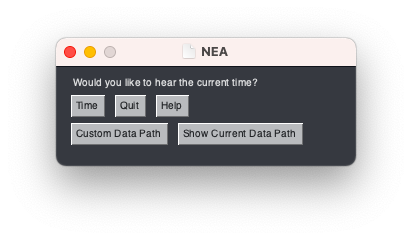

# NEA | Your Personal Speaking Clock

## Installation:

### 1. Clone the Repo

git clone https://github.com/benluks/NEA-Your-Personal-Speaking-Clock.git

### 2. Install Requirements

NEA - The Speaking Clock uses `playsound` as the audio engine. So to make sure this package works, you must install the correct version of playsound. You can find `requirements.txt` under the root directory of this repo.

```
python3 -m pip install -r requirements.txt
```

## Adding Your Own Voice Data

For reasons of privacy, we are unable to provide voice recordings. If you want to run the application you'll have to add your own voice data. Here's how to do that:

### Database format

In the root directory there is a folder called `data`, containing a metadata file called `data.txt`. Your audio data folder should be in this folder, adjacent to `data.txt`.

#### 1. Formatting the audio data

For the purposes of this explanation, we assume the bae audio folder (in the `data` folder is called '`audio`', although you can name it whatever you want, include multiple audio files, and switch between them without restarting the application.  
The folder should be formatted as follows:

```
audio
    ├──1_12
    |   ├──hour
    |   |   ├──<file1>.mp3
    |   |   ├──...
    |   |
    |   └──min
    |       ├──<file1>.mp3
    |       ├──...
    |
    ├──am_pm
    |   ├──<file1>.mp3
    |   ├──...
    |
    ├──its_oclock
    |   ├──<file1>.mp3
    |   ├──...
    |
    ├──oh
    |   ├──<file1>.mp3
    |   ├──...
    |
    ├──teens
    |   ├──<file1>.mp3
    |   ├──...
    |
    └──tens
        ├──<file1>.mp3
        ├──...
```

`1_12/hour` - Utterances from 1-12. Used for the hour.  
`1_12/min` - Utternaces from 1-10. Used for the minute.  
`am_pm` - Utterances of "am" or "pm".  
`its_oclock` - Utterances of "it's" and "o'clock". ("o'clock" is not used in this version yet, though future releases will offer this option.)  
`oh` - "Oh", as in "six-oh-one pm".  
`teens` - 10 through 19, inclusive.  
`tens` - 20, 30, 40, 50.

##### Notes:

1. Use .mp3 for the audio format.
2. For each utternace, you can have as many files as you want. One will be chosen randomly each time it is uttered.
3. Name the files as you please. We will show you how to reference them in the metadata file below. We used `<number>.mp3`, eg. `audio/teens/9.mp3`.

#### 2. Formatting your Metadata File

The file `data/data.txt` contains your metadata. You will use this to indicate which files contain which utterances.  
The file is in a quasi-csv format, delimited instead by '`|`' (ascii 124). The first row is `file|utterance|usable`. Each following row should be realized as such:

- `file` is from the `audio` directory (which can be specified in the application). An example would be `its_oclock/8.mp3`.
- `utterance` is the utterance, spelled out. Refer to the text left in the `data.txt` file for spelling conventions.
- `usable`: 1 if you want this recording used, 0 or blank otherwise. This allows you to test the viability of certain audio files with as little change as possible. Only fliles with `usable == 1` will be used in the application.

## Usage

##### Local Demonstrator with GUI

```
python3 gui.py
```



Linux and MacOSX users may experience a `ModuleNotFoundError: No module named '_tkinter'`. In this case, you'll have to install `python-tk` using `apt-get` (Linux) or `brew` (MacOSX).

##### Local Demonstrator with CLI

```
python3 main.py
```

##### Local Demonstrator with executable (PC only)

Or, you can download the executable NEA.exe, follow the instruction on how to make your own speech dataset, place the executable in the same directory as the `data` folder.

### License

[MIT](https://choosealicense.com/licenses/mit/)
